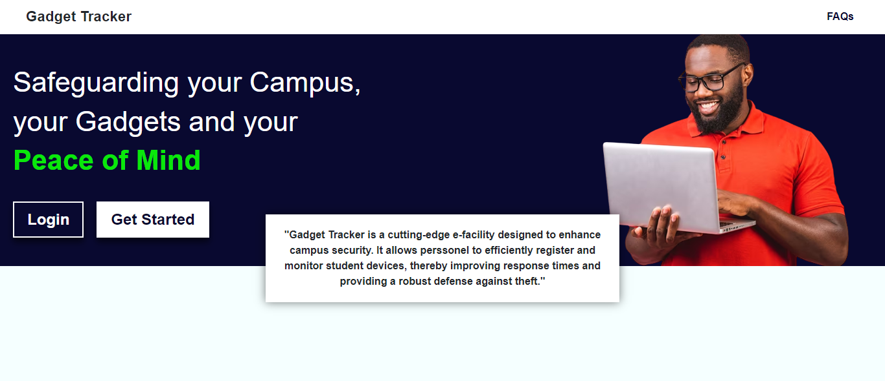

<div align="center">

</div>

<div align="center">
<hr>
<p style="font-size:15px;">Gadget Tracker is a state-of-the-art e-facility designed to bolster campus security by safeguarding your devices and ensuring your peace of mind. With Gadget Tracker, campus personnel can efficiently register and monitor student devices, significantly enhancing response times and providing a strong defense against theft. This platform aims to protect your campus, your gadgets, and most importantly, your peace of mind.</p>
</div>
<hr>

# Guidelines on how to run locally 💻

## Clone this repository

```
git clone https://github.com/Mannuel25/Gadget-Tracker.git
```


## Create a virtual environment in the Real-counselling directory
Ensure you are in the Real-counselling directory, run this command to create a virtual environment:
```
python -m venv .\venv
```
## Activate the virtual environment
Activate the virtual environment using the following command: 
```
venv\scripts\activate
```
Note: Upon running the command **venv\scripts\activate**, if this error shows up:
```
venv\scripts\activate : File C:\Users\Training\Documents\New folder\venv\scripts\Activate.ps1 cannot be loaded because running scripts is 
disabled on this system. For more information, see about_Execution_Policies at http://go.microsoft.com/fwlink/?LinkID=135170.
```
Run this command: 
``` 
Set-ExecutionPolicy -Scope CurrentUser -ExecutionPolicy Unrestricted 
```
Then run the command to activate the virtual environment
## Install all necessary packages 

```
pip install -r requirements.txt
```

## Make migrations
Run the following commands separately to make migrations
```
python manage.py makemigrations
python manage.py migrate
```
## Create a new superuser
Run the following command to create a new superuser
```
python manage.py createsuperuser
```

## Run the project

```
python manage.py runserver
```

# Screenshots 📸
Explore the user interface and features in more detail through these [screenshots.](screenshots)


# License 🔐
This project is under an [MIT LICENSE](LICENSE)

